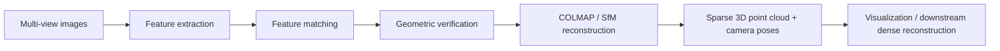

# Computer Vision 3D Reconstruction

End-to-end 3D reconstruction pipeline for turning multi-view images of a scene into a sparse 3D model using local feature extraction, feature matching, geometric verification, and Structure-from-Motion (SfM).

This repository started as an exploratory notebook and has been refactored into a cleaner computer-vision engineering project with reusable modules, a script entrypoint, documented results, and basic tests.

## Problem statement

Given a set of overlapping images of the same object, room, or outdoor scene, reconstruct the scene geometry by estimating camera poses and triangulating 3D points. The practical goal is to convert unordered multi-view images into a sparse reconstruction that can be inspected, evaluated, and extended toward dense reconstruction or neural rendering.

## Pipeline



The implemented flow is:

1. **Image collection**: capture multiple overlapping views of the scene.
2. **Feature extraction**: extract local features with HLoc-supported extractors such as SIFT or SuperPoint.
3. **Feature matching**: generate image pairs and match local features with matchers such as AdaLAM or LightGlue.
4. **Geometric verification**: verify correspondences before reconstruction.
5. **SfM reconstruction**: run COLMAP through HLoc to estimate camera poses and sparse 3D points.
6. **Visualization**: inspect reconstructed cameras and point cloud outputs.

## Tools used

- **Python**
- **Hierarchical Localization (HLoc)**
- **COLMAP / pycolmap**
- **SIFT / SuperPoint** for local feature extraction
- **AdaLAM / LightGlue** for feature matching
- **NumPy / OpenCV**
- **Open3D** for optional point-cloud visualization

## Dataset and capture setup

The original experiment used a custom multi-view image set. The notebook processed **104 input images** from the scene. Because most images were captured from one dominant side of the scene, reconstruction coverage was partial rather than fully 360-degree.

Recommended capture setup for stronger results:

- Capture 80–200 sharp images with 60–80% overlap.
- Move around the scene rather than only rotating in place.
- Avoid motion blur, reflective surfaces, and repeated texture patterns where possible.
- Keep camera intrinsics consistent if using the same device.
- Capture from multiple heights and angles to improve parallax.

## Quantitative reconstruction result

The original notebook run produced the following sparse reconstruction statistics:

| Metric | Value |
|---|---:|
| Input images | 104 |
| Registered images | 27 |
| Sparse 3D points | 2,432 |
| Mean reprojection error | 1.25835 px |
| Mean track length | 3.41612 |
| Observations | 8,308 |

See [`results/reconstruction_stats.md`](results/reconstruction_stats.md) for the preserved result summary.

## Repository structure

```text
Computer_Vision3D_reconstruction/
├── README.md
├── requirements.txt
├── main.ipynb                         # original exploratory notebook
├── notebooks/
│   └── demo_reconstruction.ipynb       # cleaned demo workflow
├── src/
│   ├── config.py
│   ├── extract_features.py
│   ├── match_features.py
│   ├── reconstruct.py
│   └── visualize.py
├── scripts/
│   └── run_reconstruction.py
├── tests/
│   ├── test_config.py
│   ├── test_pipeline_configs.py
│   └── test_reconstruction_stats.py
├── results/
│   ├── reconstruction_stats.md
│   └── sample_outputs/
└── docs/
    └── pipeline_diagram.md
```

## Quickstart

Install the Python dependencies:

```bash
python -m venv .venv
source .venv/bin/activate  # Windows: .venv\Scripts\activate
pip install -r requirements.txt
```

HLoc and COLMAP/pycolmap setup can be environment-specific. If HLoc is not already installed, follow the official HLoc installation instructions and ensure COLMAP is available.

Run the modular reconstruction script:

```bash
python scripts/run_reconstruction.py \
  --images path/to/images \
  --outputs outputs/demo-front \
  --feature-conf sift \
  --matcher-conf adalam
```

For a SuperPoint + LightGlue style run:

```bash
python scripts/run_reconstruction.py \
  --images path/to/images \
  --outputs outputs/demo-front \
  --feature-conf superpoint_max \
  --matcher-conf superpoint+lightglue
```

## Testing

The included tests focus on configuration validation, feature/matcher selection, path checks, and reconstruction-stat parsing. They do not require a full COLMAP/HLoc run.

```bash
pytest
```

## Current limitations

- The original image capture was mostly from one side of the scene, limiting parallax and coverage.
- Only **27 / 104** input images were registered in the largest sparse model.
- Dense reconstruction / neural rendering outputs are not yet included as reproducible artifacts.
- The original notebook is Colab-oriented; the new `src/` and `scripts/` layers are intended to make the project easier to run locally and easier for recruiters to inspect.
- Sample screenshots / point-cloud exports should be added when the reconstruction is rerun locally.

## Next improvements

- Add sparse reconstruction screenshots to `results/sample_outputs/`.
- Export the reconstructed point cloud as `.ply`.
- Add a dense reconstruction or Gaussian Splatting stage.
- Add CI to run `pytest` on every push.
- Add a small public sample image set so the pipeline can be reproduced without private/local data.
