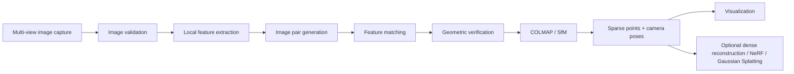

# Pipeline Diagram

```mermaid
flowchart LR
    A[Multi-view image capture] --> B[Image validation]
    B --> C[Local feature extraction]
    C --> D[Image pair generation]
    D --> E[Feature matching]
    E --> F[Geometric verification]
    F --> G[COLMAP / SfM]
    G --> H[Sparse points + camera poses]
    H --> I[Visualization]
    H --> J[Optional dense reconstruction / NeRF / Gaussian Splatting]
```

This text-based diagram is intentionally kept in source control so it can render directly in GitHub Markdown.
